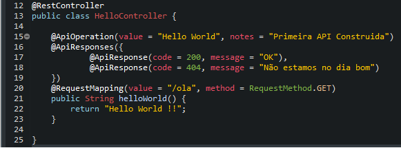
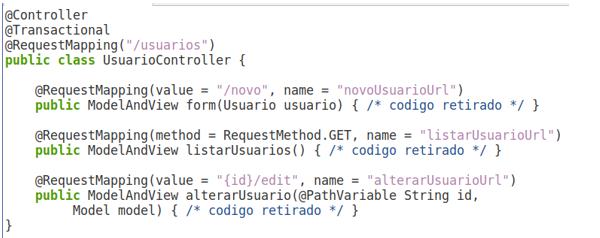
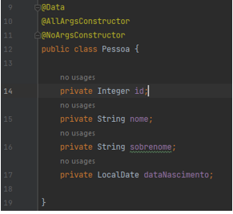

# Sprint 4 - Spring

**1 -** O que é uma API?

**2 -** O que é o padrão REST?

**3** - Dizemos que uma API é REST Full quando?

**4** - Na especificação do protocolo HTTP, usado atualmente por todas as aplicações que executam na web, existe uma lista de verbos (Ações) que podemos utilizar na construção de APIs REST, cite os cinco verbos HTTP mais comuns e de uma descrição de cada um deles.

**5** - Explique o que são REQUEST e RESPONSE?

**6** - Dado o Controller abaixo, explique qual é a finalidade do comando apresentado na linha 20

**7** - Qual é a função do arquivo pom.xml, criado automaticamente junto com um projeto Spring Boot?

**8** - Um ponto importante sobre os controladores (Controllers), é o seu relacionamento direto com a forma que os usuários interagem com o sistema, sempre através de urls mapeadas. Pensando no mapeamento entre url e controller, assinale abaixo qual método será executado quando o usuário acessar “**http://localhost:8080/usuarios**”.

1. O método form()
2. O Método listarUsuario()
3. O Método alterarUsuario()
4. o Método listarUsuarioUrl()
5. Será apresentado um erro

**9 -** MVC é um padrão de arquitetura de software criado na década de 1970, com o principal objetivo a separação interna dos sistemas em pelo menos 3 camadas lógicas interconectadas, onde cada camada é responsável por uma etapa dentro do processo de construção do software. Dito isto, o termo ***MODEL*** se refere a:

1. A camada de apresentação ao usuário
2. A camada que orquestra a comunicação do usuário com a aplicação
3. A camada que abriga as regras de negócio dos sistemas
4. A camada que representa a criação de arquivos no disco do servidor
5. Nenhuma das alternativas

**10** - Apresente os procedimentos necessários para adicionar a documentação de uma API criada com Spring Boot, de maneira automática para todos os endpoints da aplicação.

**11 -** O padrão MVC (Model-View-Controller), é um padrão de arquitetura utilizado no desenvolvimento de sistemas em qualquer linguagem de programação. Seu objetivo principal é separar o projeto em camadas, onde cada camada é responsável por uma etapa dentro do processo de construção do software. Em um projeto Spring Boot, como esse padrão é aplicado?

**12** - Dado a classe “**Pessoa**” de modelo apresentada abaixo, apresente a documentação Swagger que melhor representaria o CRUD completo com as seguintes funcionalidades

- Listar todas as pessoas
- Incluir uma nova pessoa
- Alterar uma pessoa existente
- Pesquisar uma pessoa por ID
- Deletar uma pessoa por ID

**13** - Dado a documentação criada no exercício anterior, realize as modificações necessárias para alterar o nome e descrição de todos os métodos do CRUD

**14** - Durante a construção do projeto “API de Produtos”, como não estamos utilizando banco de dados, foi preciso desenvolver uma simulação memória, com o recurso de listas (ArrayList). Como tudo em programa, existem várias formas de resolver o mesmo problema, sendo assim, de que outra forma poderíamos ter contornado a falta de banco de dados?

**15 -** Explique, com suas palavras, o que é a ferramenta “Spring Initializr”, e como ela nos auxilia durante o desenvolvimento de projetos baseados no ecossistema Spring.